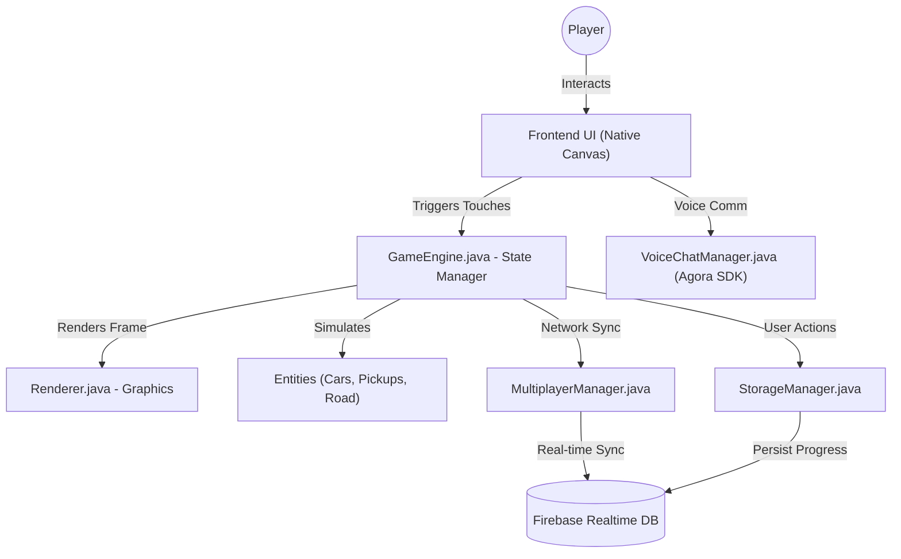

# 🏎️ TurboRush Game Architecture & Documentation

Welcome to the **TurboRush** project documentation. This document serves as a comprehensive, professional reference guide detailing the overall architecture, core systems, folder structures, and deep technical decisions that power the game.

---

## 🌟 Key Features & Innovations

- **Endless Procedural Racing**: Weave through traffic, collect coins, and pick up fuel in procedurally generated environments. The game scales in difficulty naturally as your score increases, accelerating the road speed and progressively transitioning through dynamic themes (City 🌆, Village 🏡, Mountain ⛰️, Ocean 🌊).
- **Custom Native Rendering Engine**: Built from the ground up natively using Android's `Canvas` API (`Renderer.java`). This entirely eliminates the need for heavy external game engines (like Unity or Unreal), giving absolute control over 60 FPS screen draws while maintaining an incredibly small App bundle size.
- **Real-Time Multiplayer Lobbies**: The multiplayer infrastructure allows users to create custom rooms via 4-digit codes, use auto-matchmaking, and race against up to 3 other friends simultaneously. Live synchronization ensures everyone sees the exact same cars, positions, and crash states with minimal latency.
- **Integrated Voice Communications**: Tactical communication is critical in multiplayer. Voice chat is automatically bridged when joining a multiplayer room, allowing for real-time strategy and banter directly within the app without needing external apps like Discord.
- **Robust Social Ecosystem**: Add friends globally via Firebase profiles, manage a friends list natively inside the Profile UI, send instant real-time lobby invitations (which pop up globally across the app regardless of what screen the user is on), and climb the global leaderboards.
- **Garage Progression & Upgrades**: Spend hard-earned coins to upgrade vehicle stats like Top Speed, Handling, and Durability. This creates a persistent gameplay loop that rewards long-term engagement.

---

## 🏗️ Technical Architecture

The codebase is strictly structured into modular packages to separate game logic, rendering, UI handling, and external service integrations. It intentionally avoids heavy XML Android layouts, relying entirely on programmatic, state-based UI rendering.



### 1. The Game Engine (`GameEngine.java` & `Renderer.java`)
- **State Machine**: The game relies on a centralized enum `GameState` (e.g., `MAIN_MENU`, `RACING`, `MULTIPLAYER_LOBBY`, `GARAGE`) to dictate exactly which logic is currently executing. This ensures strictly isolated environments where UI elements from the menu cannot accidentally trigger during a race.
- **Game Loop**: The Android `SurfaceView` triggers a continuous background loop that independently fires `update(dt)` for physics/logic and `draw(canvas)` for rendering, ensuring physics simulations remain accurate even if framerates fluctuate.
- **Event Routing**: `handleTouchDown(x,y)` dynamically routes user screen touches to the correct active screen boundaries by evaluating geometric `RectF` intersections. This eliminates standard Android `Button` views and click listeners.

### 2. Cloud & Database Integration (`StorageManager.java`)
- Acts as the single source of truth for all **Firebase Realtime Database** interactions, abstracting network calls away from the core game loop.
- **User Progress**: Handles saving/loading coins, XP, level, and garage vehicle stats to `users/{uid}`.
- **Social Features**: Manages adding friends by ID, fetching friend data asynchronously, and sending real-time lobby invites to `users/{uid}/invites`. It utilizes active listeners to instantly trigger invite pop-ups on the receiver's device in under a second.

### 3. Real-Time Multiplayer (`MultiplayerManager.java`)
- **Synchronization**: Syncs the player's exact X-coordinate, current racing score, and crash status to `rooms/{roomCode}/players/{uid}` at rapid intervals.
- **Host Privileges**: The host controls starting the match, generating a shared random track seed (ensuring procedurally generated AI cars spawn in the exact same patterns for all players), and holds kick privileges.
- **Spectator Mode**: If a player crashes early, their state transitions to `MULTIPLAYER_CRASHED`, allowing them to spectate the remaining alive players until the entire lobby finishes.

### 4. Voice Communications (`VoiceChatManager.java`)
- Integrates the **Agora RTC SDK** directly into the game flow.
- When a user joins a Multiplayer Room, the manager dynamically uses the `roomCode` as the Agora Audio Channel identifier.
- Provides manual Mute functionality and handles automatically disconnecting from the channel when the player leaves the lobby.

---

## 🛡️ Security & Technical Excellence

- **Strict Firebase Rules**: The Realtime Database relies on path isolation. The `users/` node acts as persistent memory for personal progress and is protected by Authentication. The `rooms/` nodes are volatile, open only during active sessions, and automatically cleaned up.
- **Clean Disconnection Handling**: `onDisconnect()` listeners are actively attached to the Firebase database in `MultiplayerManager.java`. If the host force-closes their app or loses internet, the room is instantly destroyed to prevent "ghost" lobbies. If a guest disconnects, their individual player node is wiped.
- **Memory Management & Object Pooling**: Entity creation is incredibly expensive in Java. The engine aggressively recycles objects (like off-screen `AICar`, `Coin`, and `FuelPickup` instances) in `updateEntities()` to prevent garbage collection stutters and memory leaks during infinite runs.
- **Asynchronous State Management**: Database reading/writing, room joining, and invite sending are all handled via Asynchronous Callbacks. This guarantees that the main UI rendering thread never freezes, even if the user experiences severe network latency.

---

## 🛠️ Technology Stack Breakdown

Below is an exhaustive breakdown of every major technology and library utilized, detailing precisely where and how they function:

1. **Java & Android SDK**
   - *Where:* The entire foundation of the codebase.
   - *How:* Bypasses traditional Android UI design. Utilizes native `SurfaceView`, `Canvas`, `Paint`, and `LinearGradient` for manual, frame-by-frame 2D rendering. Physics math is handled using delta-time (`dt`) for consistency across devices with different refresh rates.
2. **Google Firebase Authentication**
   - *Where:* `GameEngine.java` (Login UI flow) & `MainActivity.java` (Intent handling).
   - *How:* Handles standard Email/Password authentication as well as seamless Google Sign-In via OAuth tokens, enabling persistent identities across multiple devices.
3. **Google Firebase Realtime Database**
   - *Where:* `StorageManager.java`, `MultiplayerManager.java`, and `LeaderboardScreen.java`.
   - *How:* The backbone of the multiplayer system. Synchronizes global top-10 leaderboards, handles instantaneous player positional syncing during races (acting as the authoritative server), and acts as a messaging bus for the Friend Invite system.
4. **Agora RTC SDK**
   - *Where:* `VoiceChatManager.java`.
   - *How:* Provides low-latency, real-time voice communications over UDP. Manages audio routing, microphone permissions, and secure channel joining using the active multiplayer room code.

---

## 🚀 Setup & Installation

### Prerequisites
- **Android Studio** (Koala or newer recommended)
- **Java 17** or higher
- An active Internet Connection (required for Firebase and Agora services)

### Installation Steps
1. **Clone the repository:**
   ```bash
   git clone https://github.com/yourusername/TurboRush.git
   ```
2. **Open the project in Android Studio:**
   - Select `File > Open` and choose the root `TurboRush` directory. Wait for Gradle to fully sync.
3. **Configure Google Services (Firebase):**
   - Create a Firebase Project and add an Android App (matching the `applicationId` in your `build.gradle`).
   - Download the `google-services.json` file and place it directly in the `app/` directory.
   - Ensure you have enabled **Authentication** (Email/Password & Google) and **Realtime Database** in the Firebase Console.
4. **Configure Agora SDK (Voice Chat):**
   - Create a developer account at [Agora.io](https://console.agora.io/) and generate an App ID.
   - Inject your Agora App ID into the `strings.xml` or hardcode it in `VoiceChatManager` initialization.
5. **Build and Run:**
   - Connect your physical Android device or start an Android Emulator.
   - Click the green `Run` button in Android Studio to compile the APK and deploy the game!

---

## 🤝 Contributing
Pull requests are highly welcome! If you're planning on making major architectural changes, implementing new game modes, or refactoring the Canvas engine, please open an issue first to discuss your ideas with the core team.

## 📄 License
This project was developed for educational and portfolio purposes. All external assets (sounds, textures, sprites) belong to their respective copyright owners. Code is provided under standard open-source constraints.
